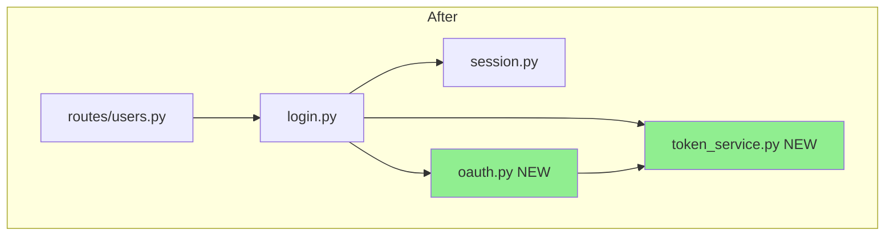
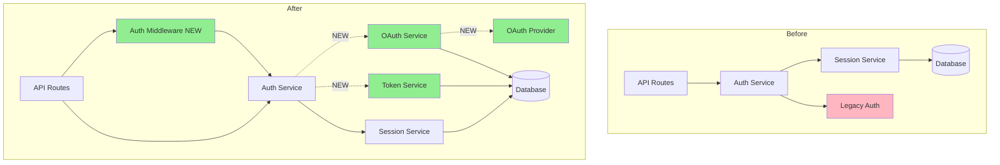

## Complete Architectural Analysis Example

This example demonstrates a full architectural analysis workflow for a PR that adds OAuth2 authentication.

### PR Context

**PR #123:** Add OAuth2 Authentication Support
**Repository:** myorg/api-server
**Base Branch:** main
**Head Branch:** feature/oauth2-auth
**Files Changed:** 16 files (+456, -123)

### Step 1: Identify Changed Files

```
Modified:
- src/auth/login.py (+85, -25)
- src/auth/session.py (+34, -18)
- src/api/middleware/auth.py (+45, -0)
- src/api/routes/users.py (+12, -8)
- src/api/routes/orders.py (+10, -6)
- alembic/versions/2024_01_19_add_oauth.py (+67, -0)
- requirements.txt (+2, -0)

Added:
- src/auth/oauth.py (+123, -0)
- src/auth/token_service.py (+78, -0)

Removed:
- src/auth/legacy_auth.py (-0, +102)
```

### Step 2: Dependency Graph Analysis

**Before:**
```
src/auth/login.py imports:
  - src/auth/session.py
  - src/auth/legacy_auth.py

src/api/routes/users.py imports:
  - src/auth/login.py
```

**After:**
```
src/auth/login.py imports:
  - src/auth/session.py
  - src/auth/oauth.py (NEW)
  - src/auth/token_service.py (NEW)

src/auth/oauth.py imports:
  - requests (NEW external dependency)
  - src/auth/token_service.py

src/api/routes/users.py imports:
  - src/auth/login.py
```

**Changes:**
- New dependency: `src/auth/oauth.py`
- New dependency: `src/auth/token_service.py`
- New external dependency: `requests` library
- Removed dependency: `src/auth/legacy_auth.py`

**Diagram:**


### Step 3: API Endpoint Detection

**Scanning src/api/routes/users.py:**
```python
# Before
@router.post("/login")
def login(credentials: LoginCredentials):
    return auth_service.login(credentials)

# After
@router.post("/login")
def login(credentials: LoginCredentials):
    return auth_service.login(credentials)

@router.post("/oauth/token")  # NEW ENDPOINT
def oauth_token(code: str, provider: str):
    return oauth_service.exchange_token(code, provider)
```

**Scanning src/api/routes/orders.py:**
```python
# Before
@router.get("/orders")
def list_orders():  # No auth required
    return order_service.list()

# After
@router.get("/orders")
@require_auth  # ADDED AUTH MIDDLEWARE
def list_orders():
    return order_service.list()
```

**API Changes Summary:**
- **New endpoint:** `POST /oauth/token` (OAuth token exchange)
- **Modified endpoint:** `GET /orders` (added authentication requirement - BREAKING)
- **Modified endpoint:** `POST /login` (unchanged interface, updated implementation)

### Step 4: Database Schema Detection

**Migration file: alembic/versions/2024_01_19_add_oauth.py**
```python
def upgrade():
    # Create new table for OAuth sessions
    op.create_table('oauth_sessions',
        sa.Column('id', sa.Integer(), nullable=False),
        sa.Column('user_id', sa.Integer(), nullable=False),
        sa.Column('provider', sa.String(50), nullable=False),
        sa.Column('access_token', sa.Text(), nullable=False),
        sa.Column('refresh_token', sa.Text(), nullable=True),
        sa.Column('expires_at', sa.DateTime(), nullable=False),
        sa.ForeignKeyConstraint(['user_id'], ['users.id'], ondelete='CASCADE'),
        sa.PrimaryKeyConstraint('id')
    )
    op.create_index('idx_oauth_sessions_user_id', 'oauth_sessions', ['user_id'])

    # Add columns to existing users table
    op.add_column('users', sa.Column('oauth_provider', sa.String(50), nullable=True))
    op.add_column('users', sa.Column('email_verified', sa.Boolean(), nullable=False, server_default='false'))

    # Drop legacy column
    op.drop_column('users', 'legacy_auth_method')

def downgrade():
    op.drop_table('oauth_sessions')
    op.drop_column('users', 'oauth_provider')
    op.drop_column('users', 'email_verified')
    op.add_column('users', sa.Column('legacy_auth_method', sa.String(20)))
```

**Schema Changes:**
- **New table:** `oauth_sessions` (stores OAuth tokens)
- **New column:** `users.oauth_provider` (nullable, non-breaking)
- **New column:** `users.email_verified` (NOT NULL with default, non-breaking)
- **Dropped column:** `users.legacy_auth_method` (BREAKING - data loss)
- **New index:** `idx_oauth_sessions_user_id` (performance improvement)

### Step 5: Data Flow Tracing

**Login flow - Before:**
```
POST /login
 → LoginController.login()
 → AuthService.validate_credentials()
 → UserRepository.find_by_email()
 → Database.query()
 → SessionService.create_session()
 → Return JWT token
```

**Login flow - After (OAuth):**
```
POST /oauth/token
 → OAuthController.exchange_token()
 → OAuthService.exchange_code()
 → HTTP Request to OAuth Provider (NEW)
 → TokenService.generate_tokens() (NEW)
 → Database.insert(oauth_sessions) (NEW)
 → Return access + refresh tokens
```

**Architectural Change:**
- Introduced external dependency on OAuth provider
- New asynchronous HTTP call in authentication flow
- Separate token storage (oauth_sessions table)

### Step 6: Component Boundary Detection

**Components identified:**
```
src/auth/           → Auth Component
  - login.py
  - session.py
  - oauth.py (NEW)
  - token_service.py (NEW)

src/api/            → API Gateway Component
  - middleware/auth.py (MODIFIED)
  - routes/users.py (MODIFIED)
  - routes/orders.py (MODIFIED)

Database            → Data Layer
  - users table (MODIFIED)
  - oauth_sessions table (NEW)
```

**Cross-component changes:**
- Auth component: 3 existing + 2 new files
- API component: 3 modified files
- Data layer: 1 modified + 1 new entity

### Step 7: Impact Assessment

**Scope:**
- Components affected: 3 (Auth, API, Database)
- Files changed: 16
- Scope: **Medium**

**Risk:**
- Breaking changes detected:
  - Removed column: `users.legacy_auth_method`
  - Added auth to public endpoint: `GET /orders`
- Risk: **High**

**Complexity:**
- Lines changed: +456, -123 (579 total)
- Files: 16
- Complexity: **Medium**

**Overall Impact: 🔴 Critical** (High risk + Medium scope)

**Breaking changes:**
1. `GET /orders` now requires authentication (clients will fail)
2. Database column `users.legacy_auth_method` dropped (data loss)

**Mitigation required:**
- Coordinate with frontend/mobile teams before deployment
- Ensure all clients updated to include authentication
- Backup legacy_auth_method data before migration
- Consider phased rollout

### Step 8: Generate Mermaid Diagram



### Step 9: Generate Report

```markdown
# Architectural Analysis: PR #123 - Add OAuth2 Authentication Support

**Repository:** myorg/api-server
**Analyzed:** 2026-01-19 14:30:22 at medium granularity

## Executive Summary

This PR adds OAuth2 authentication support to the API server, enabling users to log in via external providers (Google, GitHub, etc.). The change introduces a new authentication path alongside existing username/password login, but includes **breaking changes** that require coordination with client teams.

## Architecture Changes at a Glance

[Mermaid diagram above]

## Impact Assessment

**Scope:** Medium (3 components affected)
**Risk:** High (Breaking changes detected)
**Complexity:** Medium (579 lines across 16 files)
**Overall Impact:** 🔴 **Critical**

### Breaking Changes Detected

1. **API Change:** `GET /orders` now requires authentication
   - **Impact:** Existing clients will receive 401 Unauthorized
   - **Affected:** Frontend (v2.1), Mobile app (v1.5)
   - **Mitigation:** Update clients before deploying backend

2. **Database Change:** Removed column `users.legacy_auth_method`
   - **Impact:** Data permanently deleted
   - **Mitigation:** Backup column data before migration, verify not used in code

## Changes by Component

### Component: Auth Service

**What changed:** Added OAuth2 authentication flow

**Files affected:**
- `src/auth/oauth.py` (+123 new)
- `src/auth/token_service.py` (+78 new)
- `src/auth/login.py` (+85, -25)
- `src/auth/session.py` (+34, -18)

**New functionality:**
- OAuth token exchange with external providers
- JWT token generation and validation
- Refresh token support

**Dependencies:**
- New external dependency: `requests` library for OAuth HTTP calls
- New dependency on external OAuth providers (Google, GitHub, etc.)

### Component: API Gateway

**What changed:** Added authentication middleware, updated routes

**Files affected:**
- `src/api/middleware/auth.py` (+45 new)
- `src/api/routes/users.py` (+12, -8)
- `src/api/routes/orders.py` (+10, -6)

**API Surface Changes:**
- **New:** `POST /oauth/token` - OAuth token exchange endpoint
- **Modified:** `GET /orders` - ⚠️ **Now requires authentication** (BREAKING)
- **Modified:** `POST /login` - Updated to support OAuth flow

### Component: Database

**What changed:** New table for OAuth sessions, updated users table

**Schema changes:**
- **New table:** `oauth_sessions` (stores OAuth tokens and refresh tokens)
- **Modified table:** `users`
  - Added: `oauth_provider` (VARCHAR(50), NULL)
  - Added: `email_verified` (BOOLEAN, NOT NULL, default false)
  - Dropped: `legacy_auth_method` ⚠️ **(BREAKING)**

**Performance impact:**
- New index `idx_oauth_sessions_user_id`: Improves OAuth session lookup

## New Architectural Patterns

1. **External Service Dependency:**
   - System now depends on OAuth providers (Google, GitHub)
   - Introduces network calls in authentication flow
   - Consider: Timeout handling, circuit breakers, fallback mechanisms

2. **Token-Based Authentication:**
   - Shift from purely session-based to token-based auth
   - Enables stateless authentication
   - Separates access tokens (short-lived) from refresh tokens (long-lived)

3. **Middleware Pattern:**
   - New authentication middleware for route protection
   - Centralized auth logic (good separation of concerns)

## Dependencies & Ripple Effects

**New External Dependency:**
- OAuth Providers (Google, GitHub APIs)
  - **Risk:** Service outages affect login capability
  - **Mitigation:** Implement fallback to username/password login

**Downstream Systems Affected:**
1. **Frontend Application (v2.1)**
   - Must update to send authentication headers to `GET /orders`
   - Timeline: Deploy frontend first, then backend

2. **Mobile Application (v1.5)**
   - Must update to include auth for order listing
   - Timeline: Publish app update before backend deploy

3. **Integration Tests**
   - Update tests to mock OAuth provider responses
   - Update tests for authenticated endpoints

## Recommended Follow-Up Actions

**Before merging:**
- [ ] Coordinate with frontend team on authentication header format
- [ ] Coordinate with mobile team on deployment timeline
- [ ] Backup `users.legacy_auth_method` column data
- [ ] Add circuit breaker for OAuth provider calls
- [ ] Document OAuth setup for new developers

**Deployment strategy:**
1. Deploy frontend and mobile updates first
2. Wait for client adoption (monitor analytics)
3. Deploy backend with OAuth support
4. Monitor error rates for 401 responses
5. Gradually enable OAuth for user base

**Testing requirements:**
- Integration tests with OAuth flow
- Load testing with OAuth provider mocks
- Fallback testing (OAuth provider down)
- Migration testing on staging database

**Monitoring:**
- Track OAuth login success/failure rates
- Monitor OAuth provider response times
- Alert on elevated 401 errors
- Track adoption rate of OAuth vs traditional login

---

## Analysis Metadata

- **Granularity:** medium
- **Files analyzed:** 16
- **Components affected:** 3
- **Lines changed:** +456, -123
- **Breaking changes:** 2
- **Analysis duration:** 4.2 seconds
- **Generated by:** Claude Architecture PR Analyzer v0.1.0
```

### Key Takeaways

This complete example demonstrates:

1. **Multi-technique analysis:** Dependencies, APIs, schema, data flow, components
2. **Accurate impact assessment:** Correctly identified as Critical due to breaking changes
3. **Clear visualization:** Mermaid diagram shows architectural evolution
4. **Actionable recommendations:** Specific deployment and testing guidance
5. **Stakeholder awareness:** Identifies affected teams and coordination needs

The analysis provides everything needed for:
- Informed merge decision
- Deployment planning
- Risk mitigation
- Team coordination
- Testing strategy
