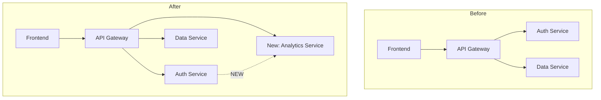
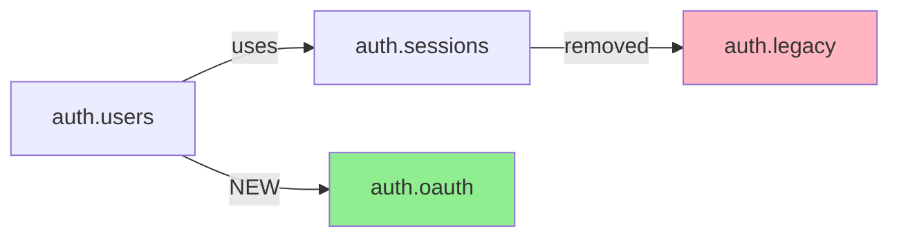
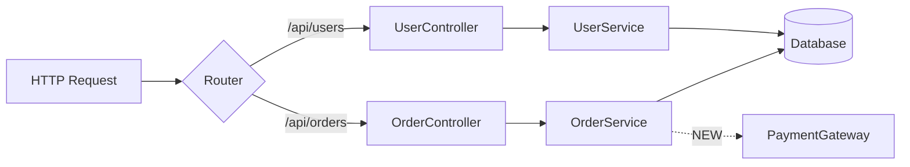

# Architectural Analysis Techniques

## Overview

This skill provides comprehensive techniques for analyzing architectural changes in codebases, particularly for pull request reviews. Use these methods to identify system-level impacts, trace dependencies, detect API and schema changes, and produce accurate architectural change reports with visual diagrams.

## Core Analysis Techniques

### 1. Dependency Graph Analysis

Build directed graphs of module dependencies to identify architectural relationships and changes.

**Purpose:**
- Identify new dependencies introduced
- Find dependencies removed
- Detect changed dependency relationships
- Spot circular dependencies

**Detection patterns:**
- Python: `import X`, `from X import Y`
- JavaScript/TypeScript: `import X from 'Y'`, `require('X')`
- Java: `import x.y.Z`
- Go: `import "package"`

**Process:**
1. Parse import/require statements from all changed files
2. Build dependency graph: `Module A → [B, C, D]`
3. Compare before/after graphs
4. Identify additions, removals, modifications

**Output format:**
- Mermaid graph diagram showing dependencies
- Text summary of changes
- Highlight new coupling or reduced dependencies

### 2. API Endpoint Detection

Identify all API endpoints and track changes to the public API surface.

**Framework patterns to detect:**

**Flask (Python):**
```python
@app.route('/api/users', methods=['GET', 'POST'])
@app.route('/api/users/<int:user_id>', methods=['PUT', 'DELETE'])
```

**FastAPI (Python):**
```python
@router.get("/users")
@router.post("/users")
@router.get("/users/{user_id}")
```

**Express (JavaScript):**
```javascript
app.get('/api/users', ...)
app.post('/api/users', ...)
router.put('/api/users/:id', ...)
```

**Django (Python):**
```python
path('api/users/', views.user_list)
path('api/users/<int:pk>/', views.user_detail)
```

**Process:**
1. Search for framework-specific decorators/route definitions
2. Extract HTTP method, path pattern, handler function
3. Compare before/after to identify new, modified, removed endpoints
4. Track which endpoints received specific changes (e.g., auth added)

**Output format:**
```markdown
### API Surface Changes

**New Endpoints:**
- `POST /api/auth/logout` (handler: `auth.logout_user`)

**Modified Endpoints:**
- `PUT /api/users/{id}` (added authentication middleware)

**Removed Endpoints:**
- `GET /api/legacy/users` (⚠️ Breaking change)
```

### 3. Database Schema Change Detection

Identify changes to database schemas, models, and migrations.

**What to detect:**

**Migration files:**
- Alembic (Python): `alembic/versions/*.py`
- Django: `*/migrations/*.py`
- Sequelize (JS): `migrations/*.js`
- Prisma: `prisma/migrations/*/migration.sql`
- Flyway (Java): `db/migration/*.sql`

**ORM models:**
- SQLAlchemy: `class User(Base): __tablename__ = 'users'`
- Django: `class User(models.Model):`
- Prisma: `model User { ... }` in `schema.prisma`
- TypeORM: `@Entity() class User`

**Process:**
1. Identify new migration files in PR
2. Parse migration operations (CREATE TABLE, ALTER TABLE, ADD COLUMN, etc.)
3. Analyze ORM model changes (new fields, removed fields, type changes)
4. Assess impact (breaking vs non-breaking)

**Output format:**
```markdown
### Database Schema Changes

**Tables Modified:**
- `users` table:
  - Added column: `email_verified` (boolean, NOT NULL, default false)
  - Added index: `idx_users_email_verified`

**Breaking Changes:**
- `orders` table: Removed column `legacy_status` (⚠️ Breaking)
```

### 4. Data Flow Tracing

Follow how data moves through the system to understand architectural changes.

**Process:**
1. Identify entry points (API endpoints, event handlers, background jobs)
2. Trace data transformations through the call chain
3. Map data flows: `HTTP Request → Controller → Service → Repository → Database`
4. Identify new flows, removed flows, modified flows

**Output format:**
```markdown
### Data Flow: User Registration

**Before:**
POST /register → UserController → UserService → Database → EmailService (sync)

**After:**
POST /register → UserController → UserService → Database → EventBus → [EmailWorker, AnalyticsWorker] (async)

**Architectural Change:**
Moved from synchronous to event-driven architecture for better decoupling.
```

### 5. Component Boundary Detection

Identify major architectural components and their boundaries.

**Detection strategies:**

**Directory structure:**
```
src/
  auth/          → Auth component
  api/           → API Gateway component
  data/          → Data Layer component
  frontend/      → Frontend component
```

**Package/Module markers:**
- Python: `__init__.py` files
- JavaScript: `package.json` in subdirectories
- Java: package declarations
- Go: directory = package

**Microservice boundaries:**
- Separate repositories or monorepo services
- Independent deployment units (own Dockerfile/manifest)
- Own database per service pattern
- Inter-service communication via APIs/events

**Process:**
1. Analyze directory structure for natural boundaries
2. Identify package/module definitions
3. Detect deployment units (Dockerfiles, k8s manifests)
4. Map cross-component dependencies

**Output format:**
```markdown
### Component Boundaries

**Components Identified:**
1. Authentication Service (`src/auth/`)
2. Order Management (`src/orders/`)
3. Payment Gateway (`src/payments/`)

**Cross-Component Changes:**
- Auth now calls Payment Gateway for subscription validation
- New dependency: Auth → Payments (⚠️ Increased coupling)
```

### 6. Impact Assessment Methodology

Quantify the scope, risk, and complexity of architectural changes.

**Scoring system:**

**Scope (components affected):**
- Low: 1-2 components
- Medium: 3-5 components
- High: 6+ components

**Risk (breaking changes):**
- Low: Internal refactoring, no API changes
- Medium: API changes with backward compatibility
- High: Breaking API changes, schema migrations, removed endpoints

**Complexity (code changes):**
- Low: <100 lines, <5 files
- Medium: 100-500 lines, 5-15 files
- High: >500 lines, >15 files

**Output format:**
```markdown
## Impact Assessment

**Scope:** Medium (4 components affected)
**Risk:** High (Breaking changes to Auth API)
**Complexity:** Medium (327 lines across 12 files)

**Overall Impact:** 🔴 High Risk
- Breaking change to authentication flow
- Requires coordination with mobile app team
- Migration strategy needed for existing sessions
```

## Mermaid Diagram Templates

### System-Level Diagram (High Granularity)



### Module-Level Diagram (Medium Granularity)



### Data Flow Diagram



Use style annotations:
- `fill:#90EE90` (light green) for new components
- `fill:#FFB6C1` (light red) for removed components
- `fill:#FFD700` (gold) for modified components
- Solid lines for existing connections
- Dashed lines (`-.->`) for new connections

## Granularity-Specific Analysis

### High Granularity (System/Domain Level)

**Focus:**
- Major system components (Auth System, API Gateway, Data Layer)
- Component-to-component relationships
- High-level architecture patterns
- Cross-cutting concerns

**Detection method:**
- Use directory structure for major boundaries
- Identify architectural layers
- Group by deployment units or major services

**Output emphasis:**
- System component diagrams
- High-level impact summary
- Inter-component dependency changes

### Medium Granularity (Module/Package/Service Level)

**Focus:**
- Individual modules, packages, or services
- Module-level dependencies
- Service interactions
- Package boundary changes

**Detection method:**
- Python: packages with `__init__.py`
- JavaScript: module exports and package.json
- Java: package declarations
- Go: packages (directory-based)

**Output emphasis:**
- Module dependency graphs
- Service interaction patterns
- Package-level change summary

### Low Granularity (Class/Function/Endpoint Level)

**Focus:**
- Individual classes, functions, API endpoints
- Function-level dependencies
- Specific code signatures and implementations
- Detailed call graphs

**Detection method:**
- Parse class definitions
- Extract function signatures
- Identify API endpoint decorators
- Track imports and usages

**Output emphasis:**
- Detailed endpoint lists
- Class hierarchy changes
- Function signature modifications
- Code-level dependency chains

## Usage Guidelines

**When analyzing a PR:**

1. **Start high-level** - Get the big picture first
2. **Use dependency graphs** - Identify coupling changes early
3. **Check API surface** - Public contracts are critical
4. **Review schema changes** - Database changes need migration planning
5. **Trace data flows** - Understand behavior changes
6. **Generate diagrams** - Visual representation aids understanding
7. **Assess impact** - Quantify scope, risk, complexity

**What to highlight:**

- ✅ Architectural improvements (better separation, reduced coupling)
- ⚠️ Potential issues (increased coupling, circular dependencies)
- 🔴 Breaking changes (removed APIs, incompatible schemas)

**Progressive detail:**

- High granularity: Focus on component interactions
- Medium granularity: Focus on module boundaries
- Low granularity: Focus on specific code entities

## Additional Resources

### Reference Files

For detailed techniques and patterns, consult:

- **`references/detection-patterns.md`** - Comprehensive patterns for detecting architectural elements across frameworks and languages
- **`references/diagram-generation.md`** - Advanced Mermaid diagram patterns and styling guide
- **`references/impact-assessment.md`** - Detailed impact assessment rubrics and decision trees

### Example Files

Working examples in `examples/`:

- **`dependency-analysis-example.md`** - Complete dependency graph analysis walkthrough
- **`api-detection-example.md`** - Multi-framework API endpoint detection examples
- **`schema-analysis-example.md`** - Database schema change analysis example

## Integration with PR Analysis

Use these techniques in combination:

1. **Fetch PR data** (via pr-integration skill)
2. **Apply analysis techniques** (this skill)
3. **Generate visualizations** (diagram templates here)
4. **Assess impact** (scoring methodology here)
5. **Produce report** (combining all insights)

This separation allows:
- Reusing analysis logic across different PR sources
- Testing analysis techniques independently
- Supporting multiple visualization formats
- Extending with new analysis methods

## Best Practices

**DO:**
- Apply multiple analysis techniques for comprehensive coverage
- Generate diagrams that clearly show changes
- Use consistent color coding (green=new, red=removed, gold=modified)
- Quantify impact with objective metrics
- Highlight breaking changes prominently
- Provide architectural reasoning, not just change lists

**DON'T:**
- Skip impact assessment
- Generate inaccurate diagrams
- Overlook subtle breaking changes
- Use vague architectural terminology
- Ignore cross-component effects
- Present raw diffs without architectural interpretation

## Quality Standards

Your architectural analysis should:

1. **Accurately identify** all architectural elements (components, APIs, schemas)
2. **Correctly trace** dependencies and data flows
3. **Clearly visualize** changes with well-labeled diagrams
4. **Properly assess** scope, risk, and complexity
5. **Highlight** breaking changes and risky modifications
6. **Provide** actionable insights for code review

Focus on architectural significance, not just code changes. Transform raw diffs into strategic insights about system design evolution.
