## Mermaid Diagram Generation Guide

Comprehensive guide for generating clear, informative Mermaid diagrams to visualize architectural changes.

## Diagram Types

### Graph Diagrams

**Use for:** Component relationships, dependencies, module connections

**Basic syntax:**
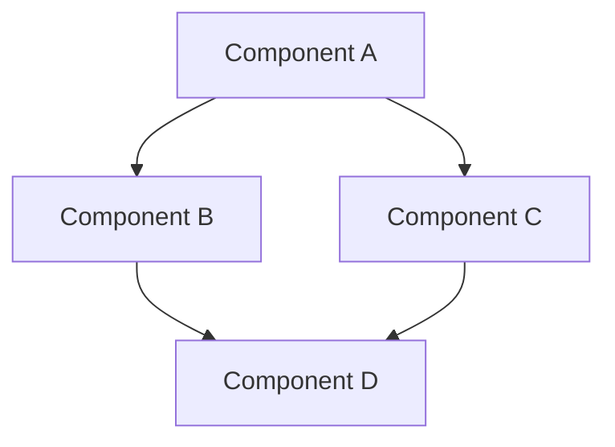

**Direction options:**
- `TD` or `TB`: Top to bottom
- `LR`: Left to right
- `RL`: Right to left
- `BT`: Bottom to top

**Choose based on:** Number of nodes, relationship complexity

### Flowchart Diagrams

**Use for:** Data flow, process flow, decision trees

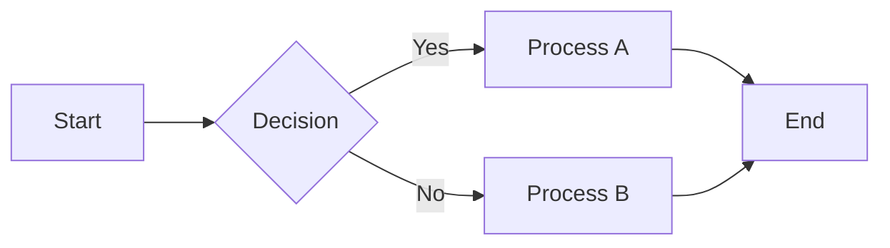

### Sequence Diagrams

**Use for:** Request/response flows, inter-service communication, API calls

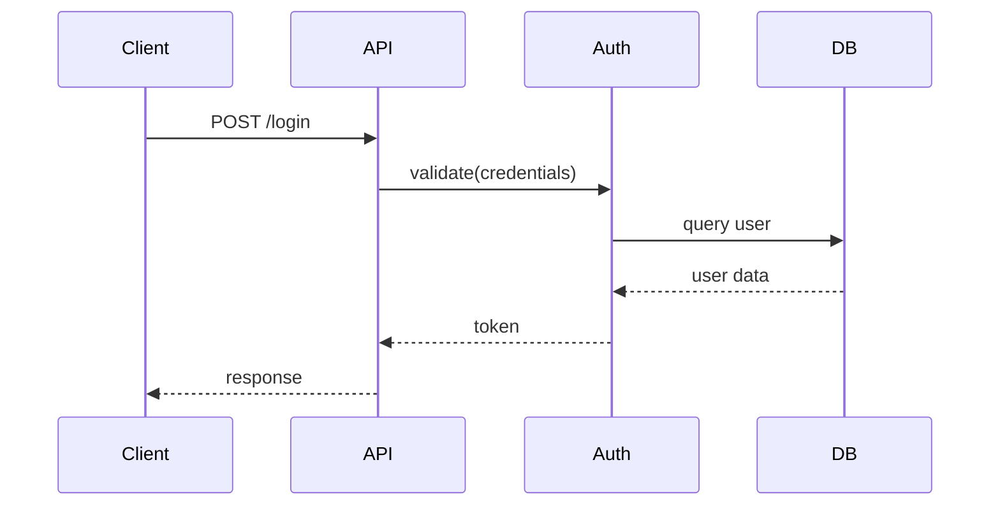

### Entity Relationship Diagrams

**Use for:** Database schema, data model relationships

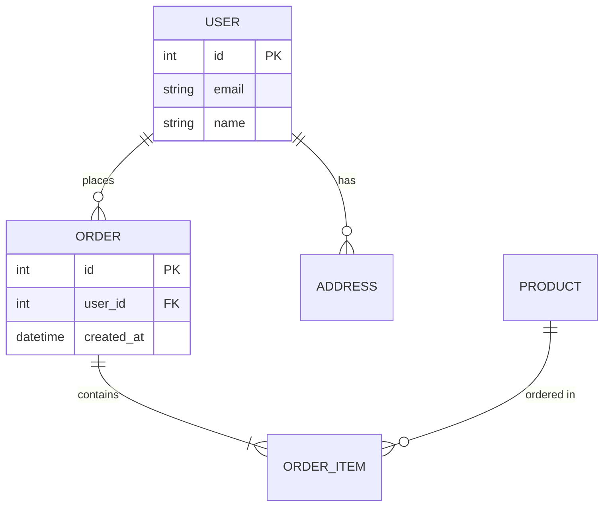

## Styling and Color Coding

### Standard Color Scheme

**New elements:** Light green (#90EE90)
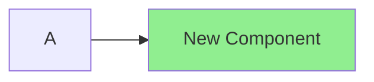

**Removed elements:** Light red (#FFB6C1)
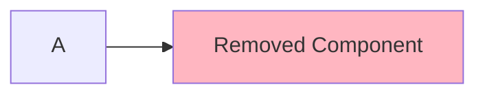

**Modified elements:** Gold (#FFD700)
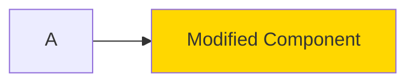

**Unchanged elements:** Default (light gray/blue)

### Line Styles

**Existing connections:** Solid lines
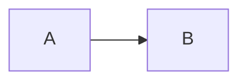

**New connections:** Dashed lines with label
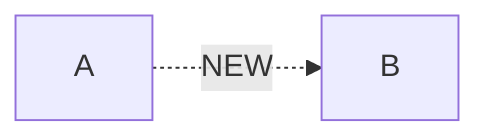

**Removed connections:** Shown in "Before" diagram, absent in "After"

### Node Shapes

**Components/Services:** Rectangles `[Label]`
**Databases:** Cylinder `[(Database)]`
**External systems:** Stadium shape `([External])`
**Decision points:** Diamond `{Decision}`
**Processes:** Rounded rectangle `(Process)`

## Before/After Pattern

### Side-by-Side Comparison

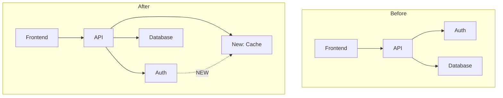

**When to use:** Showing architectural evolution at same granularity level

### Diff-Style Single Diagram

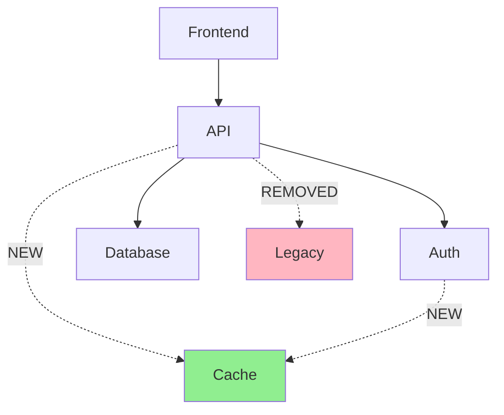

**When to use:** Emphasizing changes in existing architecture

## Advanced Techniques

### Hierarchical Diagrams

**Showing nested components:**
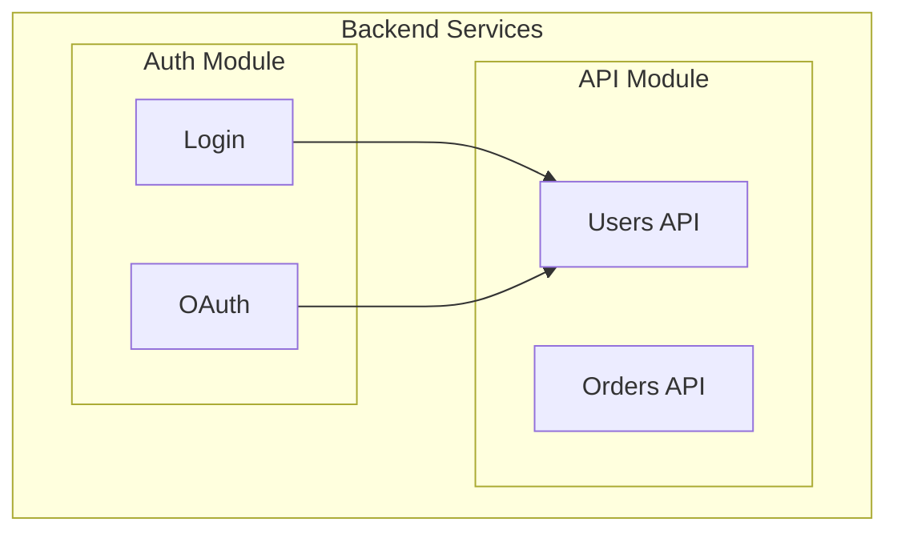

### Emphasizing Critical Paths

**Bold lines for critical flows:**
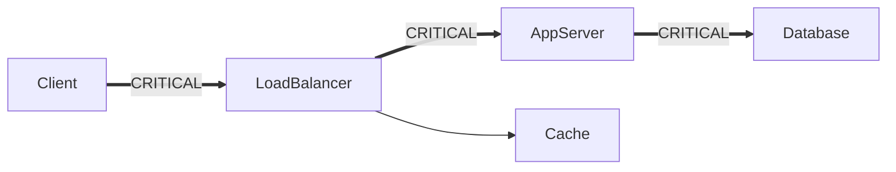

### Annotating with Metrics

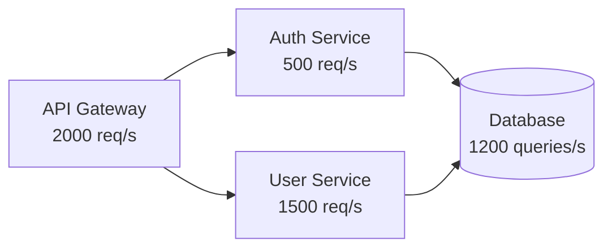

## Granularity-Specific Diagrams

### High Granularity (System Components)

**Focus:** Major components only, high-level relationships

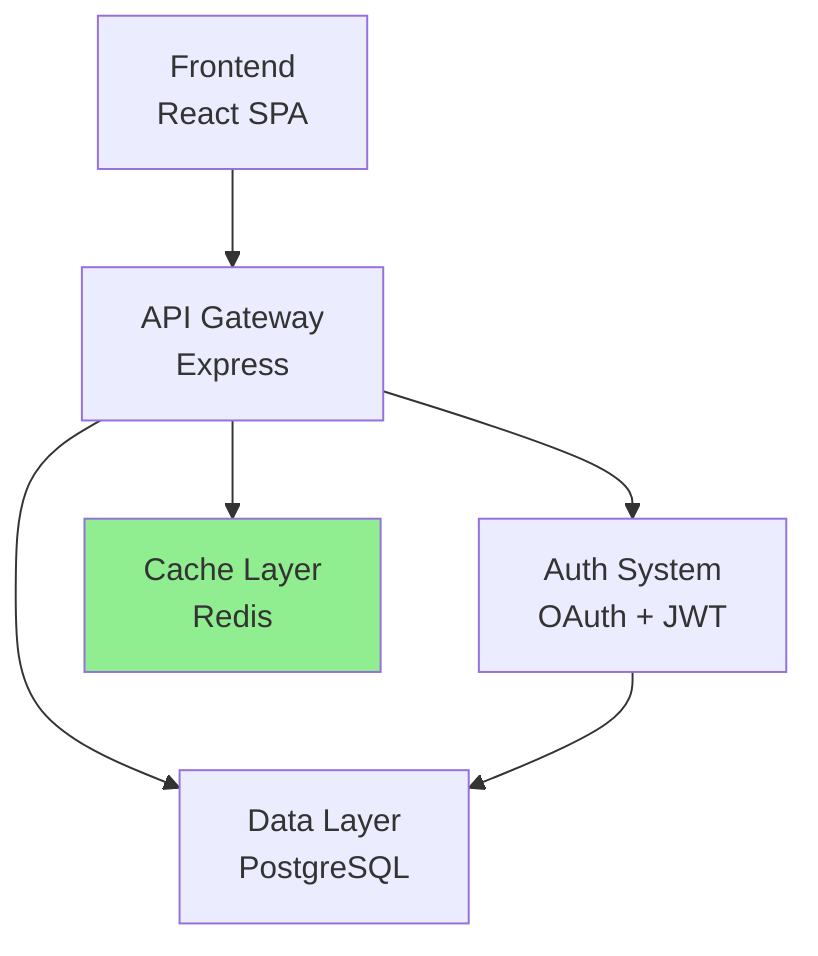

**Characteristics:**
- 5-10 nodes maximum
- Clear labels with technology stack
- Abstract implementation details
- Show major data stores

### Medium Granularity (Modules/Services)

**Focus:** Individual modules, service breakdown

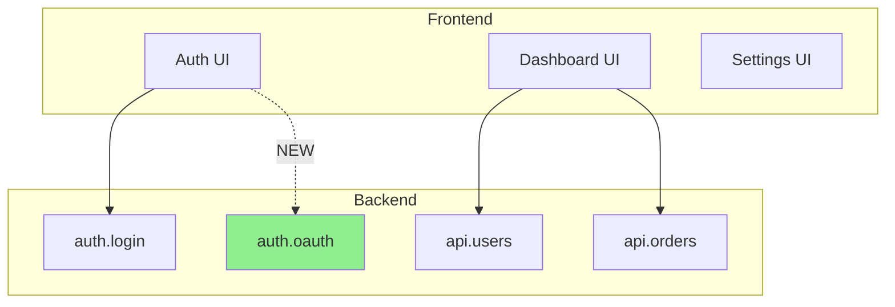

**Characteristics:**
- 10-30 nodes typical
- Group by logical boundaries
- Show module relationships
- Highlight new modules

### Low Granularity (Classes/Functions)

**Focus:** Detailed code structure

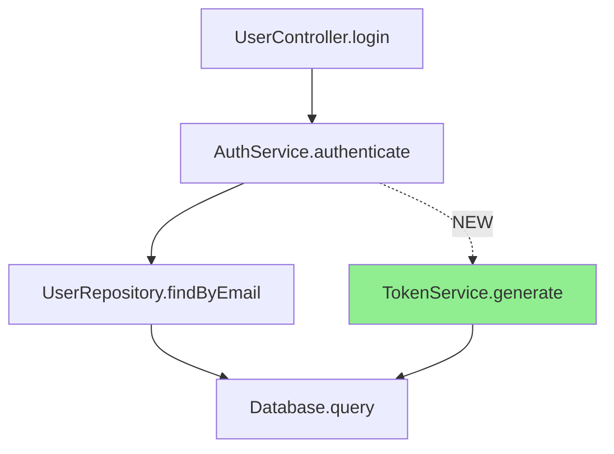

**Characteristics:**
- 20-50 nodes possible
- Function/method level
- Show call chains
- Include new functions

## Sequence Diagram Best Practices

### API Request Flow

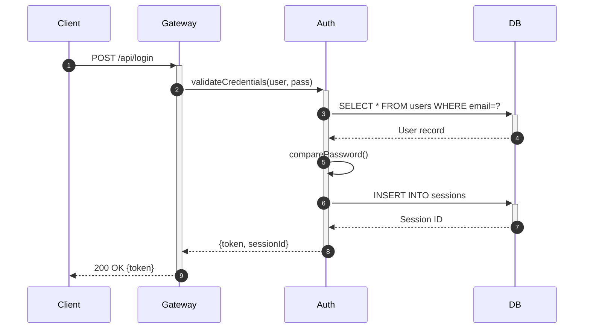

**Features:**
- `autonumber`: Adds sequence numbers
- `+`/`-`: Activation boxes
- `-->>`: Dashed return lines
- Comments: `Note over A,D: Comment text`

### Async/Event-Driven Flow

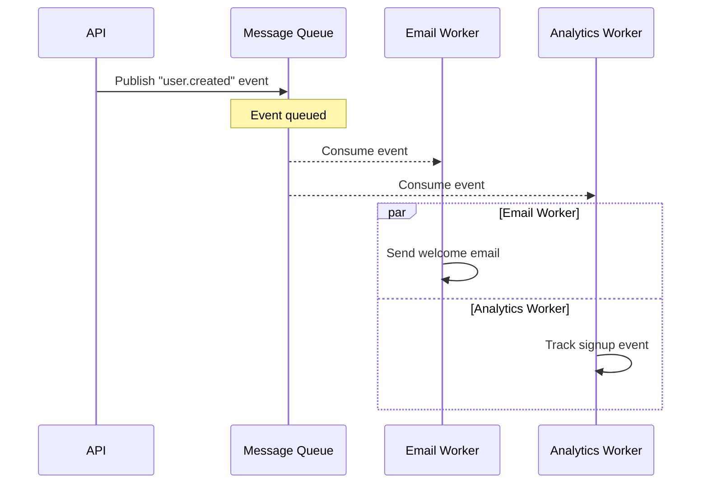

**Shows:** Parallel processing, async nature

## Entity Relationship Diagram Patterns

### Schema Changes Visualization

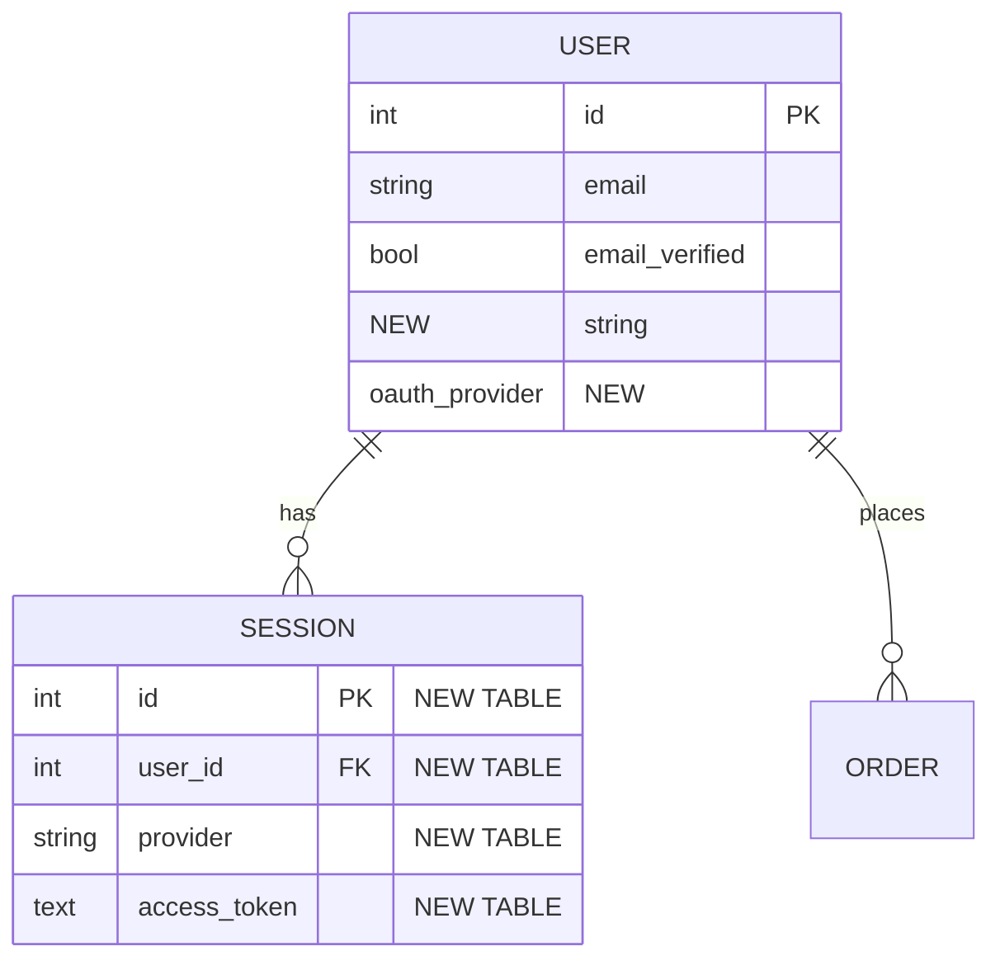

**Annotations:**
- `NEW` for new fields
- `NEW TABLE` for new entities
- Can add `REMOVED` for dropped fields

## Diagram Size Management

### Large Architecture (>30 components)

**Strategy 1: Multiple focused diagrams**
- Diagram 1: High-level overview
- Diagram 2: Auth subsystem detail
- Diagram 3: API subsystem detail

**Strategy 2: Hierarchical with expansion**
- Top level: Major components only
- Drill-down: Each component expanded separately

**Strategy 3: Layered approach**
- Diagram 1: Frontend layer
- Diagram 2: Backend layer
- Diagram 3: Data layer

### Handling Complex Relationships

**Use subgraphs for grouping:**
```mermaid
graph TB
    subgraph "Layer 1: Frontend"
        A & B & C
    end
    subgraph "Layer 2: API"
        D & E & F
    end
    subgraph "Layer 3: Services"
        G & H & I
    end

    A & B & C --> D & E & F
    D & E & F --> G & H & I
```

## Common Pitfalls

### Avoid

❌ **Too many nodes:** >50 nodes becomes unreadable
- Solution: Break into multiple diagrams or increase granularity

❌ **Unclear labels:** Generic names like "Service1", "Module A"
- Solution: Use descriptive names with context

❌ **Missing legends:** Colors/line styles without explanation
- Solution: Add legend in markdown below diagram

❌ **Inconsistent styling:** Different colors for same concept
- Solution: Define and follow color scheme

❌ **Cluttered layout:** Crossing lines everywhere
- Solution: Reorganize, use subgraphs, or split diagram

### Best Practices

✅ **Clear labels:** Include technology stack when relevant
✅ **Consistent colors:** New = green, Removed = red, Modified = gold
✅ **Logical grouping:** Use subgraphs for related components
✅ **Annotations:** Mark NEW, REMOVED, MODIFIED clearly
✅ **Appropriate detail:** Match diagram complexity to granularity
✅ **Legend provided:** Explain colors, line styles, symbols

## Markdown Integration

### Full Diagram Example with Context

````markdown
## Architecture Changes: Authentication System

### Before State

The authentication system used a simple session-based approach:

```mermaid
graph LR
    A[Login] --> B[SessionStore]
    B --> C[(Database)]
```

### After State

Added OAuth2 support with token-based authentication:

```mermaid
graph LR
    A[Login] --> B[SessionStore]
    A -.->|NEW| D[OAuth Provider]
    B --> C[(Database)]
    D -.->|NEW| E[Token Service]
    E -.->|NEW| C

    style D fill:#90EE90
    style E fill:#90EE90
```

**Legend:**
- 🟢 Green: New components
- Dashed lines: New connections

### Impact

- Added OAuth2 flow increases complexity but improves security
- New dependency on external OAuth provider
- Token service enables stateless authentication
````

## Testing Diagram Rendering

**Validate your diagrams:**

1. **Syntax check:** Paste into Mermaid Live Editor (https://mermaid.live)
2. **Visual check:** Ensure layout is clear and readable
3. **Color check:** Verify colors render correctly
4. **Label check:** All labels visible and understandable
5. **Size check:** Diagram fits in reasonable viewport

**Common rendering issues:**
- Very long labels: Break with `<br/>`
- Too many connections: Simplify or split
- Overlapping nodes: Adjust graph direction
- Missing nodes: Check syntax carefully

## Advanced Mermaid Features

### Styling Individual Elements

```mermaid
graph LR
    A[Node A]
    B[Node B]
    C[Node C]

    A --> B --> C

    classDef newClass fill:#90EE90,stroke:#333,stroke-width:2px
    classDef oldClass fill:#FFB6C1,stroke:#333,stroke-width:2px

    class B newClass
    class C oldClass
```

### Link Styling

```mermaid
graph LR
    A --> |"Normal"| B
    A -.-> |"Dashed"| C
    A ==> |"Thick"| D

    linkStyle 0 stroke:#0f0,stroke-width:2px
    linkStyle 1 stroke:#f00,stroke-width:2px,stroke-dasharray: 5 5
```

### Interactive Diagrams

```mermaid
graph LR
    A[Component A]
    B[Component B]
    C[Component C]

    A --> B
    B --> C

    click A "https://docs.example.com/component-a" "Documentation"
    click B "https://docs.example.com/component-b" "Documentation"
```

Note: Click functionality may not work in all Markdown renderers

## Summary

**Quick reference:**

- **Graph/Flowchart:** Component relationships, dependencies
- **Sequence:** API flows, request/response, inter-service
- **ERD:** Database schema, data models
- **Colors:** Green=New, Red=Removed, Gold=Modified
- **Lines:** Solid=Existing, Dashed=New
- **Size:** <30 nodes ideal, split if larger
- **Context:** Always provide legend and explanation
