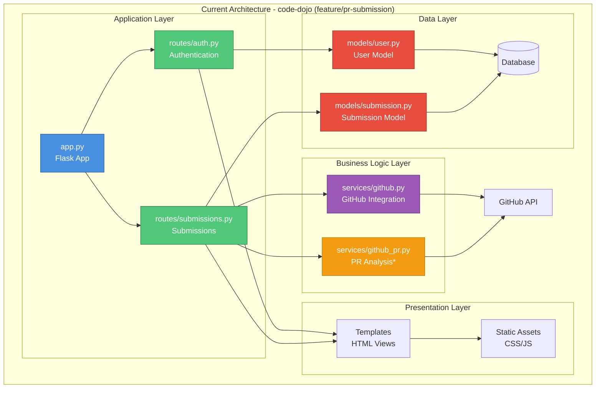

# Directory Analysis Workflow Example

This document provides a complete end-to-end example of using git integration commands to perform directory-based architectural analysis.

## Scenario

**Goal:** Analyze the architecture of a Python web application (Flask-based code review platform) in its current state, including uncommitted changes.

**Repository:** code-dojo (local development)
**Branch:** feature/pr-submission
**State:** Active development with uncommitted changes

## Step-by-Step Workflow

### Step 1: Verify Git Repository

**Command:**
```bash
git rev-parse --is-inside-work-tree
```

**Output:**
```
true
```

**Interpretation:** ✓ Valid git repository, proceed with analysis

**Error handling:**
```bash
if ! git rev-parse --is-inside-work-tree >/dev/null 2>&1; then
    echo "Error: Not a git repository"
    echo "Current directory: $(pwd)"
    echo ""
    echo "To analyze a directory, navigate to a git repository:"
    echo "  cd /path/to/your/repo"
    echo ""
    echo "Or to analyze a GitHub PR instead:"
    echo "  /arch-analyze --pr <number|url>"
    exit 1
fi
```

### Step 2: Gather Repository Metadata

**Get repository root:**
```bash
git rev-parse --show-toplevel
```

**Output:**
```
/Users/nathansuberi/Documents/GitHub/code-dojo
```

**Get repository name:**
```bash
basename -s .git $(git remote get-url origin 2>/dev/null) || basename $(git rev-parse --show-toplevel)
```

**Output:**
```
code-dojo
```

**Get current branch:**
```bash
git rev-parse --abbrev-ref HEAD
```

**Output:**
```
feature/pr-submission
```

**Context built:**
```json
{
  "repoRoot": "/Users/nathansuberi/Documents/GitHub/code-dojo",
  "repoName": "code-dojo",
  "currentBranch": "feature/pr-submission"
}
```

### Step 3: Enumerate All Files

**Command:**
```bash
git ls-files
```

**Output (truncated):**
```
.gitignore
README.md
app.py
config.py
models/__init__.py
models/submission.py
models/user.py
routes/__init__.py
routes/auth.py
routes/submissions.py
services/github.py
services/github_pr.py
static/css/styles.css
static/js/app.js
static/js/pr-preview.js
static/js/review-tab.js
templates/index.html
templates/account.html
templates/modules/goal.html
templates/submissions/student_view.html
requirements.txt
```

**Count files:**
```bash
git ls-files | wc -l
```

**Output:**
```
47
```

**Filter by type:**
```bash
# Python files
git ls-files | grep "\.py$" | wc -l
# Output: 23

# JavaScript files
git ls-files | grep "\.js$" | wc -l
# Output: 8

# HTML templates
git ls-files | grep "\.html$" | wc -l
# Output: 12

# CSS files
git ls-files | grep "\.css$" | wc -l
# Output: 4
```

**File list collected:** 47 total files identified

### Step 4: Detect Uncommitted Changes

**Get full status:**
```bash
git status --porcelain
```

**Output:**
```
 M config.py
 M models/submission.py
 M routes/submissions.py
 M services/github.py
 M static/css/styles.css
 M static/js/review-tab.js
 M templates/account.html
 M templates/modules/goal.html
 M templates/submissions/student_view.html
?? services/github_pr.py
?? static/js/pr-preview.js
?? tests/test_github_pr.py
```

**Parse changes:**
```bash
# Modified files (unstaged)
MODIFIED=$(git status --porcelain | grep "^ M" | wc -l | tr -d ' ')
# Output: 9

# Untracked files
UNTRACKED=$(git ls-files --others --exclude-standard | wc -l | tr -d ' ')
# Output: 3

# Total changes
TOTAL_CHANGES=$((MODIFIED + UNTRACKED))
# Output: 12
```

**Status summary:**
```json
{
  "modifiedFiles": 9,
  "untrackedFiles": 3,
  "totalChanges": 12,
  "workingDirectoryClean": false
}
```

### Step 5: Read File Contents

For each file in the tracked list, read contents using the Read tool.

**Example: Read Python application entry point**

File: `app.py`

**Using Read tool:**
```
Read(file_path="/Users/nathansuberi/Documents/GitHub/code-dojo/app.py")
```

**Contents (excerpt):**
```python
from flask import Flask, render_template, session, redirect, url_for
from routes import auth, submissions
from models import db, User
import config

app = Flask(__name__)
app.config.from_object(config)
db.init_app(app)

app.register_blueprint(auth.bp)
app.register_blueprint(submissions.bp)

@app.route('/')
def index():
    if 'user_id' not in session:
        return redirect(url_for('auth.login'))
    return render_template('index.html')

if __name__ == '__main__':
    app.run(debug=True)
```

**Example: Read modified file (includes uncommitted changes)**

File: `services/github_pr.py` (untracked - recently added)

**Using Read tool:**
```
Read(file_path="/Users/nathansuberi/Documents/GitHub/code-dojo/services/github_pr.py")
```

**Contents (excerpt):**
```python
"""GitHub PR service for fetching and parsing pull request data."""

import requests
from typing import Dict, List, Optional

class GitHubPRService:
    def __init__(self, token: str):
        self.token = token
        self.base_url = "https://api.github.com"

    def get_pr_details(self, owner: str, repo: str, pr_number: int) -> Dict:
        """Fetch PR details from GitHub API."""
        url = f"{self.base_url}/repos/{owner}/{repo}/pulls/{pr_number}"
        headers = {"Authorization": f"token {self.token}"}
        response = requests.get(url, headers=headers)
        response.raise_for_status()
        return response.json()
```

**Note:** This file is untracked but included in analysis because we read from the working directory.

**Process all files in parallel:**
```python
# Pseudocode
files = git_ls_files()
file_contents = []

# Use parallel processing for performance
for batch in chunk(files, batch_size=10):
    batch_results = read_files_parallel(batch)
    file_contents.extend(batch_results)
```

### Step 6: Build Analysis Context

Combine all gathered data into a context object:

```json
{
  "mode": "directory",
  "repoPath": "/Users/nathansuberi/Documents/GitHub/code-dojo",
  "repoName": "code-dojo",
  "currentBranch": "feature/pr-submission",
  "granularity": "medium",
  "snapshot": true,
  "includeUncommitted": true,

  "statistics": {
    "totalFiles": 47,
    "modifiedFiles": 9,
    "untrackedFiles": 3,
    "filesByType": {
      "python": 23,
      "javascript": 8,
      "html": 12,
      "css": 4
    }
  },

  "files": [
    {
      "path": "app.py",
      "type": "python",
      "content": "from flask import Flask...",
      "modified": false,
      "untracked": false,
      "size": 1024
    },
    {
      "path": "config.py",
      "type": "python",
      "content": "import os...",
      "modified": true,
      "untracked": false,
      "size": 512
    },
    {
      "path": "services/github_pr.py",
      "type": "python",
      "content": "\"\"\"GitHub PR service...",
      "modified": false,
      "untracked": true,
      "size": 2048
    }
    // ... all 47 files
  ]
}
```

### Step 7: Pass to Architectural Analysis

This context is now passed to the `architectural-analysis` skill for:

1. **Component identification**
   - Routes: auth, submissions
   - Services: github, github_pr
   - Models: user, submission
   - Templates: UI components
   - Static assets: CSS, JS

2. **Dependency mapping**
   - app.py → routes → services → models
   - templates → static assets
   - services → external APIs (GitHub)

3. **Architecture diagram generation** (Mermaid)

4. **Report creation**

### Step 8: Expected Output

**Console output:**
```
✓ Architecture Snapshot Complete

Repository: code-dojo
Branch: feature/pr-submission
Granularity: medium

Architecture Summary:
Flask-based code review platform with modular architecture. Three main
layers: presentation (templates), business logic (routes/services), and
data (models). Integrates with GitHub API for PR analysis.

Components identified: 5
Files analyzed: 47
Uncommitted changes: Included (9 modified, 3 untracked)

Full snapshot saved to:
.claude/analyses/snapshot-code-dojo-feature-pr-submission-2026-01-19-143022.md
```

**Saved report:** `.claude/analyses/snapshot-code-dojo-feature-pr-submission-2026-01-19-143022.md`

**Report contents (excerpt):**

```markdown
# Architecture Snapshot: code-dojo (feature/pr-submission)

**Repository:** /Users/nathansuberi/Documents/GitHub/code-dojo
**Branch:** feature/pr-submission
**State:** Current working directory
**Uncommitted changes:** 9 modified, 3 untracked
**Analyzed:** 2026-01-19T14:30:22Z at medium granularity

---

## Executive Summary

This Flask-based code review platform demonstrates a clean, modular architecture
with clear separation of concerns. The application follows MVC patterns with
routes handling HTTP requests, services managing business logic, and models
representing data structures.

Recent development focus appears to be on GitHub PR integration, with new
services/github_pr.py module adding enhanced PR analysis capabilities. The
architecture supports both traditional code submission review and direct GitHub
PR review workflows.

## Architecture Diagram



*Note: Orange indicates untracked/new files*

## Component Catalog

### Application Entry Point
- **Type:** Core/Infrastructure
- **Location:** /
- **Files:** app.py
- **Dependencies:** routes (auth, submissions), models (db, User), config
- **Description:** Flask application initialization and configuration. Registers
  blueprints for authentication and submissions. Handles root routing and
  session management.

### Authentication Route
- **Type:** Business Logic
- **Location:** routes/
- **Files:** routes/auth.py
- **Dependencies:** models.User, templates
- **Description:** User authentication flow including login, logout, and
  registration. Manages user sessions and GitHub OAuth integration.

### Submissions Route
- **Type:** Business Logic
- **Location:** routes/
- **Files:** routes/submissions.py
- **Dependencies:** models.Submission, services.github, services.github_pr, templates
- **Description:** Core submission management including code review workflows.
  Handles both traditional code submissions and GitHub PR submissions. **Recently
  modified** to integrate new PR analysis service.

### GitHub Integration Service
- **Type:** External Integration
- **Location:** services/
- **Files:** services/github.py, services/github_pr.py
- **Dependencies:** External GitHub API
- **Description:** GitHub API integration layer. Original github.py handles basic
  operations; **new github_pr.py module** (untracked) adds enhanced PR analysis
  capabilities including diff parsing, file change detection, and review comment
  management.

### Data Models
- **Type:** Data Layer
- **Location:** models/
- **Files:** models/user.py, models/submission.py
- **Dependencies:** Database (SQLAlchemy)
- **Description:** Data models representing users and code submissions. **Recently
  modified submission.py** likely adds PR-related fields or relationships.

## Uncommitted Changes

### Modified Files (9)
- `config.py` - Configuration changes (possibly GitHub token management)
- `models/submission.py` - Data model updates for PR support
- `routes/submissions.py` - New PR submission workflow
- `services/github.py` - GitHub service enhancements
- `static/css/styles.css` - UI styling for PR features
- `static/js/review-tab.js` - Review interface JavaScript
- `templates/account.html` - Account page updates
- `templates/modules/goal.html` - Goal module template
- `templates/submissions/student_view.html` - Student submission view

### Untracked Files (3)
- `services/github_pr.py` - **NEW** PR analysis service
- `static/js/pr-preview.js` - **NEW** PR preview JavaScript
- `tests/test_github_pr.py` - **NEW** Tests for PR service

**Development in progress:** Adding GitHub PR submission and review capability

---

**Analysis Metadata:**
- Plugin: arch-pr-analyzer v1.0
- Mode: Directory Snapshot
- Granularity: medium
- Files Analyzed: 47
- Timestamp: 2026-01-19T14:30:22Z
```

## Performance Metrics

For this analysis:

**Git operations:**
- Repository detection: ~10ms
- File enumeration: ~50ms (47 files)
- Status check: ~30ms
- Metadata gathering: ~40ms
- **Total git time:** ~130ms

**File reading:**
- 47 files, average 15KB each
- Parallel processing (10 files at a time)
- Total read time: ~2s

**Analysis:**
- Component identification: ~500ms
- Dependency mapping: ~300ms
- Diagram generation: ~200ms
- Report writing: ~100ms
- **Total analysis time:** ~1.1s

**Total workflow time:** ~3.2 seconds

## Key Takeaways

1. **Git operations are fast** - Even for moderate-sized repos
2. **File reading dominates** - Most time spent reading file contents
3. **Uncommitted changes included** - Provides real-time architectural feedback
4. **Parallel processing helps** - Batch file reads for better performance
5. **Context-rich output** - Developers get immediate architecture insights

## Common Variations

### Variation 1: Clean working directory

If `git status --porcelain` returns empty:
```
Uncommitted changes: None (working directory clean)
```

### Variation 2: Large repository

For repos with 1000+ files:
- Add progress indicators
- Process in larger batches (50-100 files)
- Consider file type filtering
- Use caching for repeated analyses

### Variation 3: Monorepo analysis

For monorepos, analyze specific subdirectory:
```bash
cd services/api
/arch-analyze
```

Git commands work from any subdirectory within repo.

### Variation 4: Detached HEAD

If branch detection returns `HEAD`:
```
Branch: HEAD (detached)
Commit: 84d230d
```

## Troubleshooting

### Issue: "Not a git repository"

**Symptom:**
```
fatal: not a git repository (or any of the parent directories): .git
```

**Solution:**
```bash
# Initialize git repo first
git init
git add .
git commit -m "Initial commit"

# Then analyze
/arch-analyze
```

### Issue: Permission denied reading files

**Symptom:**
```
Error: Cannot read file: /path/to/file.py
Permission denied
```

**Solution:**
```bash
# Check file permissions
ls -l file.py

# Fix permissions if needed
chmod 644 file.py
```

### Issue: No files found

**Symptom:**
```
Warning: No files to analyze
No tracked files found in repository.
```

**Solution:**
```bash
# Check if files are tracked
git ls-files

# If empty, add files
git add .
git commit -m "Add files"
```

## See Also

- Main skill documentation: `../SKILL.md`
- Git commands reference: `../references/git-commands.md`
- Architectural analysis skill: `../../architectural-analysis/SKILL.md`
